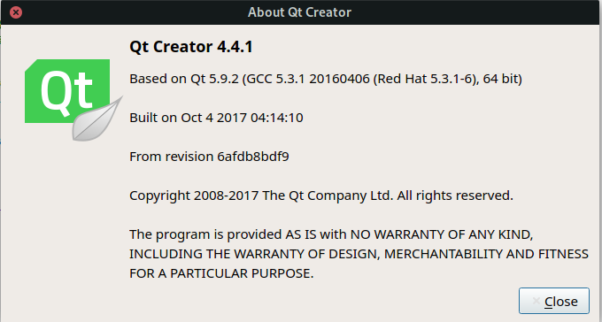
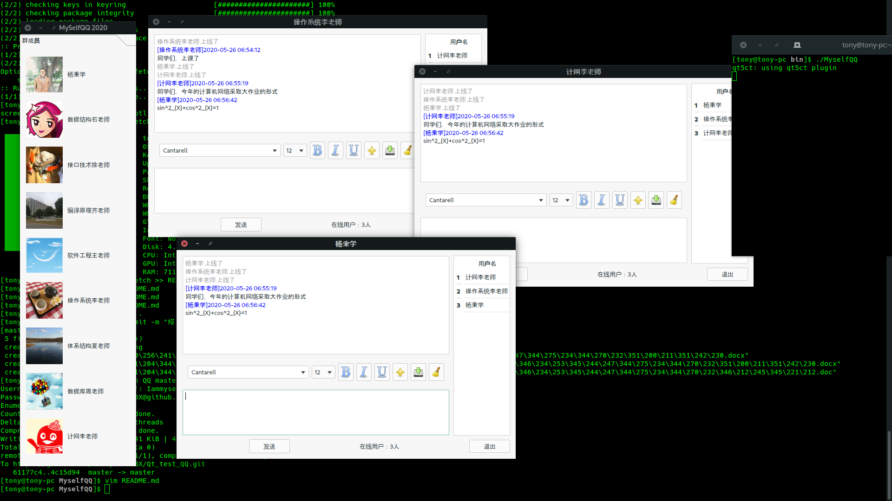

# 2020计算机网络期末大作业——制作一个QQ
socket编程：实现一个网络聊天程序。语言不限、开发平台不限。可以采用udp、socket，也可以采用TCPsocket.
## 下载
```bash
git clone https://github.com/IammyselfYBX/Qt_test_QQ.git
```

## doc 目录
该目录存放<b>选题</b>与<b>报告</b>。
```bash
doc
├── 附件1-计算机网络期末大作业选题.docx
└── 附件2-计算机网络期末大作业报告.doc

0 directories, 2 files
```

## 开发环境
```bash
 ██████████████████  ████████     tony@tony-pc
 ██████████████████  ████████     OS: Manjaro 19.0 Kyria
 ██████████████████  ████████     Kernel: x86_64 Linux 5.4.18-1-MANJARO
 ██████████████████  ████████     Uptime: 385d 13h 39m
 ████████            ████████     Packages: 1301
 ████████  ████████  ████████     Shell: bash 5.0.11
 ████████  ████████  ████████     Resolution: 1920x1080
 ████████  ████████  ████████     DE: GNOME 3.34.4
 ████████  ████████  ████████     WM: Mutter
 ████████  ████████  ████████     WM Theme: Matcha-dark-sea
 ████████  ████████  ████████     GTK Theme: Matcha-dark-sea [GTK2/3]
 ████████  ████████  ████████     Icon Theme: Papirus-Dark
 ████████  ████████  ████████     Font: Noto Sans 11
 ████████  ████████  ████████     Disk: 4.7T / 4.8T (99%)
                                  CPU: Intel Core i7-8550U @ 8x 4GHz [46.0°C]
                                  GPU: Intel Corporation UHD Graphics 620 (rev 07)
                                  RAM: 7113MiB / 15899MiB
```


## 运行
```bash
cd bin/
make
./MyselfQQ
```

